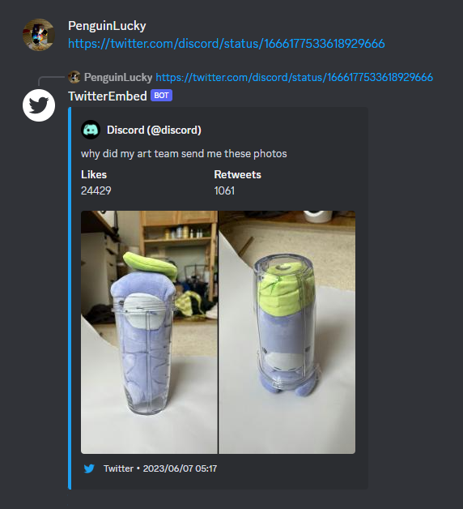
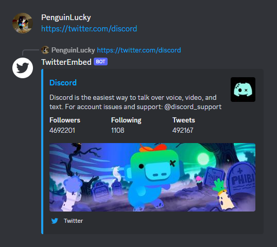

  <h1>Twitter Embeds Is Back!!</h1>

[招待する](https://discord.com/api/oauth2/authorize?client_id=1166385565072113705&permissions=274877990912&scope=bot) |
[機能](#features) |
[プライバシーポリシー](bot/privacy-policy.ja.md) |
[English](README.md)

## [招待する](https://discord.com/api/oauth2/authorize?client_id=1166385565072113705&permissions=274877990912&scope=bot)

## 機能
DiscordにてTwitterの埋め込みを復活させます。

このBotはメッセージ内に以下の条件がマッチした場合にメッセージを送信します。 
{UserId}と{TweetId}はTwitterのURLを参考にしてください。

### ツイート
- https://x.com/{UserId}/status/{TweetId}
- https://twitter.com/{UserId}/status/{TweetId}

### ユーザー
- https://x.com/{UserId}
- https://twitter.com/{UserId}

## ライセンス
このプロジェクトは MITライセンス の下で利用可能です。 
ライセンスの全内容については、[LICENSE](LICENSE) を参照してください。